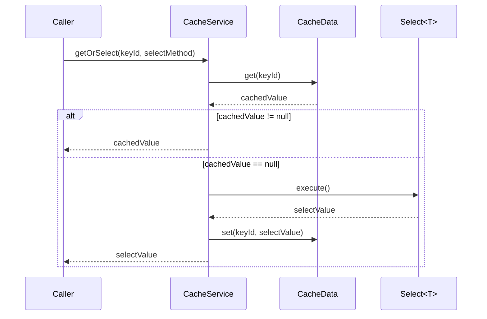

# CacheService

## 만든 이유 : Cache를 사용하기 위한 Template
1. 반복되는 Redis Cache 사용 함수를 모아서 관리하기 위함
2. Spring, SpringBoot가 아닌 Service에서 또한 Redis Cache를 똑같이 사용하기 위함
3. Redis가 문제가 생겼을 때 Local Cache를 통한 CacheService를 제공하기 위함

## 가능한 Cache 방식
1. Redis (used Jedis)
> Jedis, apache.commons-pool 사용
2. InMemory (used Local Memory)
> ConcurrentHashMap 사용

## 주요 함수 / 사용 예시
### Generate CacheService
first init Cache **Pool** before init CacheService
```java
Pool cachePool;
try {
    // try generate RedisPool
    cachePool = Cache.generateRedisPool(host, port, username, password, maxConnectionCount); // throws ConnectFailExeption
} catch (ConnectFailException e) {
    // generate InMemoryPool
    cachePool = Cache.generateInMemoryPool();
}
```

and make CacheService with generated Pool
```java
CachService userCacheService = Cache.cacheService("user", cachePool);
```
### 1. getOrSelect
**Method signature**
```java
T getOrSelect(Long keyId, Select<T> selectMethod);
```
try get CachedData and return cachedValue  
if not exists execute selectMethod and save selectValue

**Usage example**
```java
CacheService userCacheService; // generated CacheService

User userEntity = userCacheService.getOrSelect(
        userId, // key Id
        ()->userRepository.findById(userId) // executed only on cache miss
);
```

---

### 2. getListOrSelect (multi getOrSelect)

**Method signature**

```java
List<T> getListOrSelect(List<Long> keyIds, Select<List<T>> selectMethod);
```
when get many CachedData if calling 'getOrSelect' multiple times can cause an N+1
use getListOrSelect method instead

selectMethod must return a List that **contains all values for keyIds** and is **sorted in the same order as keyIds.**  
(selectMethod 함수의 반환값은 언제나 keyIds의 모든 값을 가져야 하면 keyIds오 동일한 순서로 정렬되어 있어야 합니다)

**Usage example**

```java
CacheService<User> userCacheService; // generated CacheService

List<User> users = userCacheService.getListOrSelect(
        userIds, // key id list
        () -> userRepository.findAllById(userIds) // must be sorted by userIds
);
```

---

### 3. getListOrSelect (multi getOrSelect with group key)

**Method signature**

```java
List<T> getListOrSelect(Long groupKeyId, List<Long> keyIds, Select<List<T>> selectMethod);
```

Only the groupKeyId parameter has been added from "getListOrSelect(List<Long> keyIds, Select<List<T>> selectMethod)"

selectMethod must return a List that **contains all values for keyIds** and is **sorted in the same order as keyIds.**  
(selectMethod 함수의 반환값은 언제나 keyIds의 모든 값을 가져야 하며 keyIds와 동일한 순서로 정렬되어 있어야 합니다)

**Usage example**

```java
CacheService<User> userCacheService; // generated CacheService

List<User> users = userCacheService.getListOrSelect(
        groupKeyId, // group cache key
        userIds,    // key id list
        () -> userRepository.findAllById(userIds) // must be sorted by userIds
);
```
