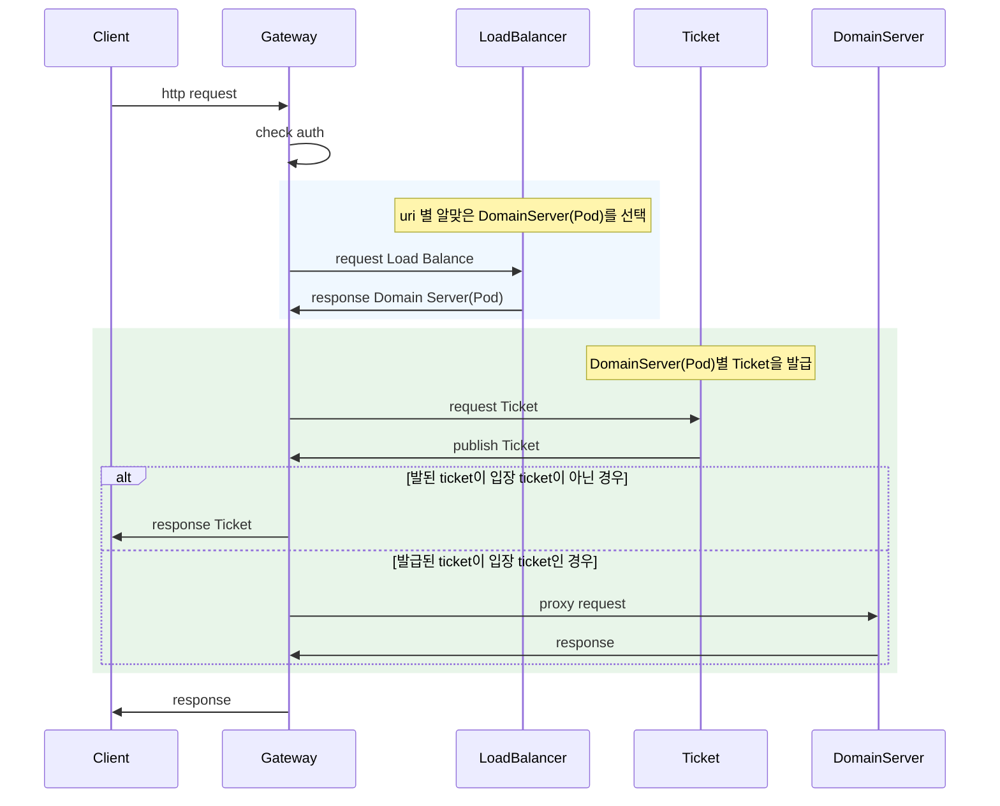
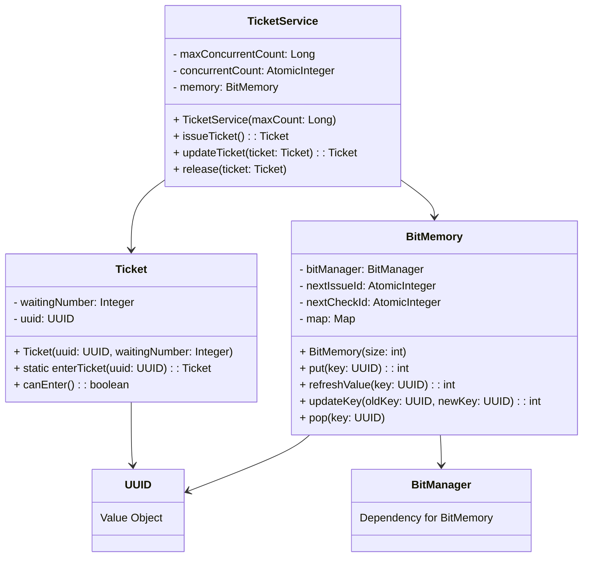
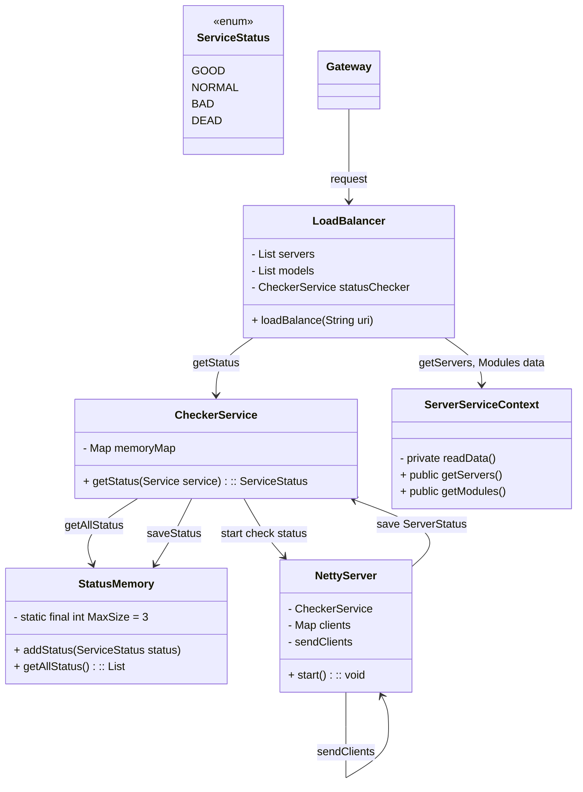

# Gateway

# 목차
1. 주요 기능 / 전체 흐름도
2. ping test 결과
3. 기능 별 상세 내용

## 1. 주요 기능 / 전체 흐름도
1. proxy
2. ticket service
3. load balancer
4. auto scale out

## Gateway Server ping test 결과 (확인 필요 대충 적음)  

test 환경 : 적어줘~  

|초당 request|처리 시간|
|--|--|
|20개|500ms|

## 3. 기능 별 상세 내용
### 1. proxy server
> 구현 목표
1. 모든 request를 알맞은 domain 서버에게 proxy를 담당한다
2. auth를 처리한다

> 사용한 라이브러리 : Netty

netty 이유,

### 2. ticket service
> 구현 목표 :  domain server 마다 request의 개수를 정해진 개수 이하로 유지한다
> (ex : user server의 request 개수를 10개 이하로 유지한다)

1. domain server 마다 현재 처리 중인 request의 개수를 기록한다
2. domain server 별 초과된 request에게 ticket을 발급하여 관리한다

> 구현 요약

구현 class : Ticket, TicketService, Memory

### 3. load balancer 
> 구현 목표 : request uri, service status을 감안하여 service를 proxy할 service를 선정한다
1. request uri 별 처리할 module을 결정한다
2. module의 service들중 가장 상태가 좋은 service를 선정한다
2. 일정 시간마다 모든 service의 status를 조사하고 관리한다 

Network domain 정리함, LoadBalancer를 구현함

> service status 판단 근거 : pid 개수, test api 속도
1. docker api를 통한 pid 개수 
2. test api 호출 속도
