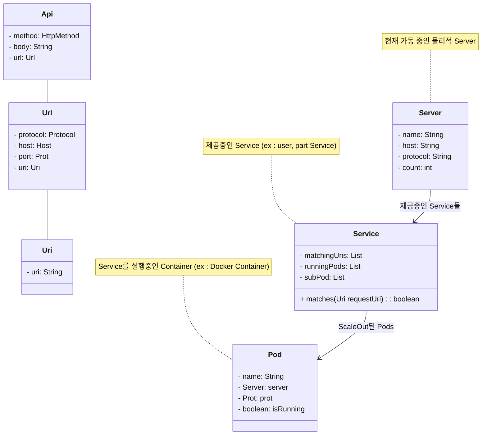

network domain 설명  
Api : HttpMethod, body, Url   
Url : Protocol, Host, Port, Uri  
uri : uri. pattern  

Server : 현재 가동 중인 물리적 Server  
Service : 제공중인 Service (ex : user, part Service)  
Pod : Service를 실행중인 Container (ex : Docker Container)

